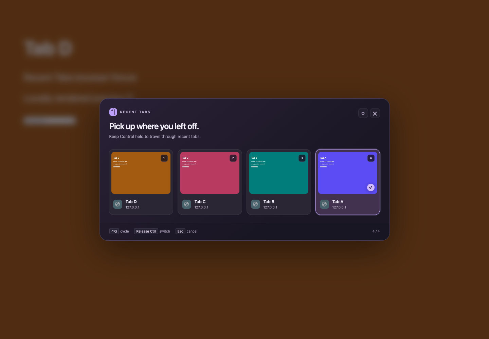

# Recent Tabs

An Arc-inspired recent-tab switcher for Chrome, with local screenshot previews. Hold **Control**, press **Q** repeatedly to browse tabs in the order you last visited them, then release Control to switch.

**[Download the latest release](https://github.com/onjas-6/recent-tabs/releases/latest)** · [Install with an agent](./INSTALL_WITH_AGENT.md) · [中文说明](#中文说明) · [Verification](./VERIFY.md)



Current version: **0.1.2**. Requires **Chrome 127+**. This is an independent project inspired by Arc; it is not affiliated with Arc or Chrome.

## Install

The extension is distributed as an unpacked extension. **No build, Node.js, Python, or npm installation is needed.**

1. Download `recent-tabs-portable-v0.1.2.zip` from the [latest release](https://github.com/onjas-6/recent-tabs/releases/latest), or download this repository. Extract it to a permanent local folder.
2. Open `chrome://extensions` and enable **Developer mode**.
3. Click **Load unpacked** and select the extracted project's **`extension/`** subfolder, not the project root.
4. Pin **Recent Tabs** from Chrome's extensions menu.
5. Open `chrome://extensions/shortcuts`. Confirm **Control + Q** for the next recent tab and **Control + Shift + Q** for the reverse direction, both scoped to **In Chrome**. Chrome may leave conflicting shortcuts unassigned or preserve old bindings after an update; check the actual saved values.
6. Open the extension's settings using the gear icon, click **Enable website previews**, and accept Chrome's optional website-access permission. Visit a few ordinary web pages and pause briefly on each to populate the preview cache. Refresh existing pages if the overlay does not appear.

On macOS, use the physical **Control key (`⌃`)**, not Command (`⌘`). Command + Q quits Chrome. Other operating systems may reserve a conflicting shortcut; check your installation before relying on it.

Website access is optional. Without it, you can still select tabs by title from the toolbar popup. After installation, **do not move or delete the loaded folder**. Unpacked extensions do not automatically install on another computer through Chrome Sync; load the folder and grant permissions separately on each computer.

To delegate installation, use the ready-to-paste instructions in [INSTALL_WITH_AGENT.md](./INSTALL_WITH_AGENT.md). The project also includes [AGENTS.md](./AGENTS.md) for an agent working from the downloaded folder.

## Use

Visit four tabs in the order **A → B → C → D**, ending on D:

| Action | Result |
| --- | --- |
| Hold Control and press Q | Select C in the preview; D remains the active tab |
| Keep Control held and press Q again | Select B, then A |
| Release Control | Activate the selected tab |
| Hold Control and press Shift + Q | Move in the reverse direction |
| Press Esc | Cancel and stay on the original tab |
| Use arrow keys or Tab / Shift + Tab in the panel | Move the selection |
| Press Enter or click a card | Activate that tab |

The recent-tab order stays fixed during a selection session, so repeated commands can reach several previous tabs. The next session starts from the latest actual visit order. Switching is limited to the current window; incognito windows are not supported.

**Want Control + Tab?** Chrome reserves that shortcut, so the extension cannot bind it directly. An optional [macOS Karabiner configuration](./macos/README.md) maps Control + Tab to Control + Q inside Chrome. It is not required for the default shortcut. The mapping has only been checked statically, not tested with a physical keyboard.

## Previews and privacy

Previews are **cached screenshots from your last visit**, not live views of background tabs. A tab without a saved screenshot displays its icon or initial and title instead.

- Screenshots are JPEGs up to 480 pixels wide. The cache holds at most 30 images and uses a conservative storage budget of about 5 MiB.
- Screenshots remain in the extension's local browser-session storage. They are cleared when previews are disabled, the extension is reloaded, or the browser restarts. **Clear saved previews** in settings removes them immediately.
- The extension has no remote server and does not upload tab details or screenshots. A screenshot may include anything visible on the page at capture time.
- `tabs` reads tab titles, URLs, and visit order; `storage` holds settings and session data; `scripting` and `activeTab` support the page overlay; `favicon` supplies Chrome's site icons.
- Optional website access enables automatic capture of the page you are viewing and the in-page overlay. Disabling previews removes this permission.

## Known limits

Chrome settings pages, the Chrome Web Store, built-in PDF views, local files, and other restricted pages may prevent injection or screenshots. The extension falls back to the toolbar popup, with titles when screenshots are unavailable.

A very fast Control release can be missed while focus moves from the address bar or browser UI to the panel. If the panel remains open, press **Enter** to confirm or **Esc** to cancel.

The release-to-switch logic passed browser-input tests. **A person has not yet verified the complete physical gesture of holding Control, pressing Q several times, and releasing Control.** Native shortcut dispatch, selection order, previews, Enter, and Esc were separately checked through Chrome's native UI. Windows and Linux have not been tested. See [VERIFY.md](./VERIFY.md) for the test evidence and its limits.

## Development

Install and use the extension without running any of these commands. To run the logic tests, use **Node.js 20+**; no third-party test packages are required:

```sh
npm test
```

The current validation includes **37 passing logic tests** and **10 passing Chrome browser scenarios**. Browser-test setup and reproduction commands are in [VERIFY.md](./VERIFY.md).

Source lives in [extension/](./extension/), tests in [tests/](./tests/), and the original implementation plan in [PLAN.md](./PLAN.md). After editing the extension, reload it in `chrome://extensions` and refresh the pages you are testing.

## 中文说明

这是一个借鉴 Arc 交互的 Chrome 最近标签切换扩展。**按住 Control，多次按 Q，按最近访问顺序选择之前的标签，松开 Control 确认**；支持截图卡片、标题、站点图标、反向选择和取消。只切换当前窗口的标签，不支持无痕窗口。

### 安装与换电脑

1. 从 [最新 Release](https://github.com/onjas-6/recent-tabs/releases/latest) 下载完整 ZIP，解压到准备长期保留的位置。无需构建，也不需要安装 Node.js、Python 或 npm。
2. 打开 `chrome://extensions` → **开发者模式** → **加载已解压的扩展程序**，选择项目中的 **`extension/` 子文件夹**。
3. 固定扩展图标，在 `chrome://extensions/shortcuts` 确认实际快捷键为 **Control + Q** 和 **Control + Shift + Q**，范围为 **在 Chrome 中**。macOS 用物理 Control（`⌃`），不是会退出浏览器的 Command（`⌘`）。已有快捷键冲突或升级后保留旧绑定时，需要在这里调整。
4. 点击扩展图标中的齿轮 → **Enable website previews**，允许网站访问权限。依次浏览几个普通网页并稍作停留，即可积累预览截图。已有网页若没有面板，可刷新后重试。

换电脑时复制完整文件夹，重新加载扩展、授权和检查快捷键；Chrome Sync 不会自动安装解压扩展。**加载后不要移动或删除文件夹。** 给 agent 安装时，直接使用 [INSTALL_WITH_AGENT.md](./INSTALL_WITH_AGENT.md) 中的完整指令。

### 使用与边界

按 A → B → C → D 的顺序访问四个标签后，在 D 按住 Control 连按 Q，会依次选中 C、B、A；加 Shift 反向，Esc 取消，Enter 或点击卡片也能确认。预览是上次浏览时保存在本机会话中的截图，不是后台实时画面；可以在设置中清空。Chrome 内置页等受限页面会使用工具栏备用弹窗。

**完整的物理按住／松键手势仍待人手验收**，松键逻辑已通过浏览器输入测试，原生快捷键分发、选择顺序、预览及 Enter／Esc 已分别验证。从地址栏发起时，极快松键可能丢失；若面板未关闭，用 Enter 确认或 Esc 取消。Windows、Linux 和可选的 [Control + Tab 系统映射](./macos/README.md) 尚未实测。完整验证范围见 [VERIFY.md](./VERIFY.md)。
